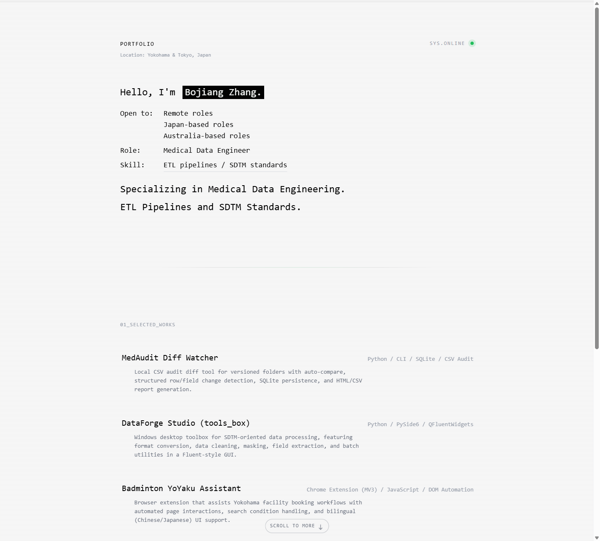

# portfolio-intro

> 一个终端 / CRT 气质的静态个人主页，用很轻的技术栈承载个人兴趣、技术方向和代表作品，适合公开展示、持续维护和快速部署。

[](https://bojiang.org)
[](https://developer.mozilla.org/docs/Web/HTML)
[](https://developer.mozilla.org/docs/Web/CSS)
[](https://developer.mozilla.org/docs/Web/JavaScript)
[](https://tailwindcss.com)
[](#本地预览)
[](#页面亮点)

## 在线体验

- 访问地址: [https://bojiang.org](https://bojiang.org)
- 仓库地址: [https://github.com/hakupao/portfolio-intro](https://github.com/hakupao/portfolio-intro)

## 页面预览



## 这个项目的内核

这个项目不是“把简历搬上网页”，也不是复杂的博客系统，而是一个更接近个人 `landing page` 的公开入口:

- 用终端、扫描线、打字机和轻微滚动动效，营造一种 `system online` 的技术人格。
- 用最少依赖完成完整表达，让页面易读、易改、易部署，不需要为了一个个人首页引入完整前端工程体系。
- 用数据驱动的内容结构，把“个人信息 / 项目 / 联系方式”和“渲染 / 动效”拆开，降低长期维护成本。

换句话说，它更像一个为“技术爱好 + 个人表达 + 公开展示”准备的静态首页骨架。

## 页面亮点

- `content.js` 负责内容数据，改文案、项目、联系方式时不需要翻动一整页 HTML。
- `main.js` 负责绑定和交互，包含打字机标题、滚动 reveal、滚动提示、外链处理和降级逻辑。
- `styles.css` 负责视觉气质，集中定义了 CRT 扫描线、光标辉光、打字效果、项目 hover 和节奏变量。
- 对 `prefers-reduced-motion: reduce` 做了兼容，减少动效时页面仍然可读可用。
- 没有构建步骤，直接就是一个可部署的静态站点，对 GitHub Pages、Cloudflare Pages、Netlify 一类平台都足够友好。
- 通过时间戳拼接资源版本和 `_headers` 缓存策略，降低静态部署后资源缓存不一致的问题。

## 适用场景

- 技术人个人主页
- Side project / hobby project 的作品集入口
- 独立开发者、工程师、数据从业者的在线名片
- 需要快速上线、后续又希望低维护成本的静态展示页

如果你要的是博客、文档站、CMS 或多页面复杂导航，这个仓库就不是那个方向。

## 技术栈

- `HTML`
- `Vanilla JavaScript`
- `Tailwind CSS CDN`
- `JetBrains Mono`
- 纯静态部署

## 项目结构

```txt
portfolio_intro/
├─ assets/
│  └─ portfolio-intro-preview.png
├─ _headers
├─ content.js
├─ favicon.svg
├─ index.html
├─ main.js
├─ styles.css
├─ tailwind.config.js
└─ README.md
```

## 如何定制内容

最常改的是 [`content.js`](./content.js) 里的 `window.PORTFOLIO_CONTENT`:

- `pageTitle`
- `headerLabel`
- `headerLocation`
- `availabilityTitle`
- `hero.*`
- `sections.*`
- `projects[]`
- `contacts[]`
- `footer.*`

你可以把它理解为一个轻量 CMS 数据对象:

```js
window.PORTFOLIO_CONTENT = {
  hero: {
    greetingPrefix: "Hello, I'm",
    name: "Your Name.",
    openTo: "Remote roles\nFreelance work",
    role: "Your Role",
    skill: "Your Skill Stack",
  },
  projects: [
    {
      title: "Project Name",
      stack: "JavaScript / Something",
      description: "One-line value proposition",
      href: "https://github.com/your/project",
    },
  ],
};
```

维护约定:

- 内容优先放在 `content.js`
- 结构优先改在 `index.html`
- 行为优先改在 `main.js`
- 视觉变量优先改在 `styles.css` 顶部 `:root`

## 本地预览

这个项目没有构建步骤，直接启动静态服务即可:

```powershell
python -m http.server 8000
```

然后访问 [http://localhost:8000](http://localhost:8000)。

如果只是快速查看，也可以直接打开 `index.html`，但带本地静态服务时更接近真实部署环境。

## 部署建议

这是一个典型的静态站点仓库，部署方式尽量保持简单:

1. 推送到 GitHub。
2. 选择任意静态托管平台。
3. 将仓库根目录作为发布目录。

当前线上展示地址为 [https://bojiang.org](https://bojiang.org)。

## 适合公开展示的原因

- 首页信息密度高，但仍然足够克制，不会像简历堆砌。
- 技术风格鲜明，能传达个人趣味，而不是套一个通用模板。
- 仓库结构小而清楚，别人点进来能快速理解你是怎么做的。
- README 已包含在线入口、预览图、技术标签和维护方式，适合作为公开仓库首页。
