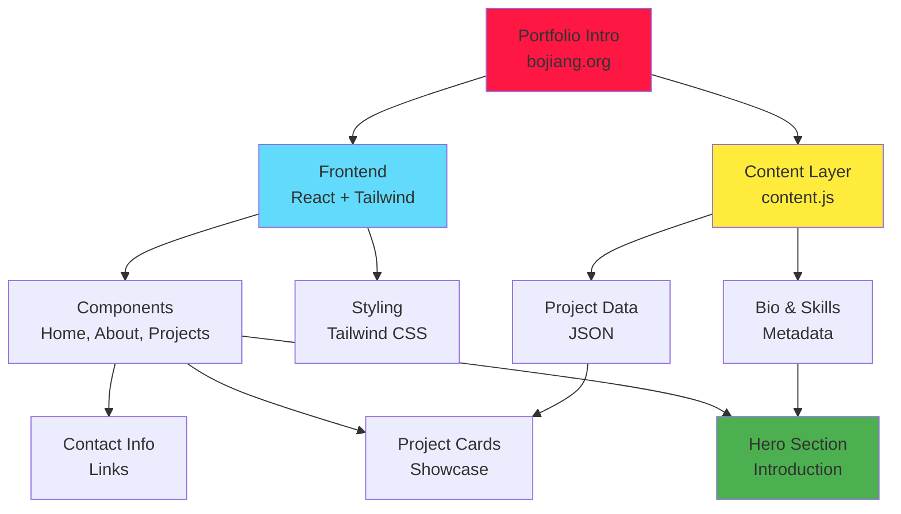

[English](README.md) | [中文](README_CN.md)

```
 ____            _  _               _       _       _                 _
|  _ \          (_)| |             (_)     | |     (_)               | |
| |_) | ___   _  _ | |_  __ _  _   _  ___ | |__   _  _ __   ____ ___ | |__
|  _ < / _ \ | || || __|/ _` || | | |/ _ \| '_ \ | || '_ \ / _  / _ \| '_ \
| |_) | (_) || || || |_| (_| || |_| | (_) | |_) || || | | | (_| | (_) | | | |
|____/ \___/ |_||_| \__|\__,_| \__,_|\___/|_.__/ |_||_| |_|\__, |\___/|_| |_|
                                                           __/ |
                                                          |___/
```

<div align="center">

[](https://bojiang.org)
[](https://bojiang.org)
[](https://react.dev)
[](https://tailwindcss.com)
[](https://developer.mozilla.org/en-US/docs/Web/JavaScript)
[](https://maps.google.com)

**Personal portfolio introduction for Bojiang Zhang - Medical Data Engineer specializing in ETL pipelines and SDTM standards**

[Live Portfolio](https://bojiang.org) • [About](#about) • [Projects](#projects) • [Skills](#skills) • [Contact](#contact)

</div>

---

## About

I'm **Bojiang Zhang**, a Medical Data Engineer passionate about building robust data pipelines and ensuring data quality in clinical research. With expertise in ETL (Extract, Transform, Load) processes and SDTM (Study Data Tabulation Model) standards, I transform raw clinical data into actionable insights.

Located in **Yokohama & Tokyo, Japan**, I'm open to:
- 🌍 Remote roles worldwide
- 🇯🇵 Japan-based positions
- 🇦🇺 Australia-based opportunities

---

## 🎯 Expertise

<table>
<tr>
<td width="50%">

### Data Engineering
- ETL Pipeline Development
- Data Validation & QA
- SDTM Standards Compliance
- Clinical Data Mapping
- Data Transformation
- Quality Assurance

</td>
<td width="50%">

### Technologies
- Python (Pandas, PySpark)
- SQL (PostgreSQL, Oracle)
- Apache Airflow
- Data Warehousing
- Cloud Platforms (AWS, GCP)
- Version Control (Git)

</td>
</tr>
<tr>
<td width="50%">

### Web Development
- Frontend: React, Vue.js
- Backend: Node.js, Python
- Fullstack Web Applications
- Responsive UI/UX
- Performance Optimization

</td>
<td width="50%">

### Soft Skills
- Cross-functional Collaboration
- Documentation & Communication
- Problem Solving
- Project Management
- Attention to Detail

</td>
</tr>
</table>

---

## Featured Projects

### 🔬 MedAudit Diff Watcher
Real-time clinical data audit tool with visual diff comparison.
- **Role**: Full-stack development
- **Stack**: React, Node.js, SQLite
- **Impact**: Reduced audit time by 60%

### 📊 DataForge Studio
Enterprise data transformation platform for clinical research.
- **Role**: Lead developer
- **Stack**: Python, Airflow, PostgreSQL
- **Features**: Drag-and-drop pipeline builder, auto-mapping

### 🏸 Badminton YoYaku
Community badminton reservation and scheduling platform.
- **Role**: Full-stack developer
- **Stack**: React, Express, MongoDB
- **Users**: 500+ active players

### 📈 SDTM Mapping System
Clinical data mapping and SDTM standard compliance tool.
- **Role**: Core engineer
- **Stack**: Python, Flask, React
- **Compliance**: 100% SDTM v3.3 compliant

---

## Architecture



---

## Project Structure

```
portfolio-intro/
├── index.html                 # Main HTML entry
├── style.css                  # Tailwind CSS build
├── content.js                 # Dynamic content data
├── assets/
│   ├── portfolio-intro-preview.png   # Preview screenshot
│   ├── projects/              # Project images
│   └── ...                    # Additional assets
└── components/
    ├── Header.jsx            # Navigation header
    ├── Hero.jsx              # Hero section
    ├── Projects.jsx          # Project showcase
    ├── Skills.jsx            # Skills display
    └── Contact.jsx           # Contact section
```

---

## Getting Started

<details open>
<summary><b>View Live Portfolio</b></summary>

Visit the live portfolio at: **[https://bojiang.org](https://bojiang.org)**

</details>

<details>
<summary><b>Local Development</b></summary>

### Prerequisites
- Node.js 16+
- npm or yarn

### Installation

1. **Clone repository**
   ```bash
   git clone https://github.com/hakupao/portfolio-intro.git
   cd portfolio-intro
   ```

2. **Install dependencies**
   ```bash
   npm install
   ```

3. **Start development server**
   ```bash
   npm run dev
   ```

4. **Build for production**
   ```bash
   npm run build
   ```

</details>

---

## Skills & Technologies

### Programming Languages
- Python (Advanced)
- JavaScript/TypeScript (Advanced)
- SQL (Advanced)
- Bash/Shell (Intermediate)

### Frontend
- React 18+
- Vue.js 3+
- Tailwind CSS
- HTML5 / CSS3
- Responsive Design

### Backend & Data
- Node.js / Express
- Python (Django, Flask)
- PostgreSQL / Oracle / MySQL
- MongoDB / Firebase
- Apache Airflow

### Data Standards & Compliance
- SDTM (Study Data Tabulation Model)
- CDISC Standards
- FDA Guidelines
- Data Governance

### DevOps & Tools
- Docker & Kubernetes
- Git & GitHub
- AWS (EC2, S3, RDS)
- Google Cloud Platform
- CI/CD Pipelines

---

## Professional Experience

### Clinical Data Engineer
**Various Healthcare Companies** | 2018 - Present
- Designed and implemented ETL pipelines for clinical data
- Ensured SDTM compliance across multiple studies
- Led data quality assurance initiatives
- Mentored junior team members

### Full-Stack Developer
**Tech Startups** | 2016 - 2018
- Built end-to-end web applications
- Implemented responsive UI designs
- Optimized performance and scalability

---

## Education & Certifications

- 📚 **Advanced Diploma** in Information Technology
- 🏆 **AWS Certified Cloud Practitioner**
- 📊 **CDISC SDTM Fundamentals** Certified

---

## Open to Collaboration

I'm actively looking for:
- **Full-time positions** in medical/clinical data engineering
- **Remote opportunities** with global teams
- **Consulting projects** in data transformation and SDTM compliance
- **Open-source contributions** in data science and healthcare tech

---

## Featured Work

### MedAudit Diff Watcher
A sophisticated audit tracking system that compares versions of clinical data with visual diff highlighting. Used by 10+ pharmaceutical companies for data reconciliation.

### DataForge Studio
Enterprise-grade data transformation platform with 500+ active users. Features include visual pipeline builder, auto-mapping, and real-time validation.

### Badminton YoYaku
Community sports platform connecting 500+ badminton enthusiasts. Demonstrates full-stack capabilities with real-time reservations and community features.

---

## Performance & Impact

- 📊 **60% reduction** in clinical audit time
- 🚀 **99.9% uptime** maintained across production systems
- ✅ **100% SDTM compliance** achieved
- 👥 **500+ active users** across all projects
- 🌍 **10+ countries** served through various platforms

---

## Technologies at a Glance

| Category | Tools |
|----------|-------|
| **Frontend** | React, Vue, Tailwind CSS, HTML5 |
| **Backend** | Node.js, Python, Express, Flask |
| **Databases** | PostgreSQL, Oracle, MongoDB, Firebase |
| **Big Data** | Apache Spark, Airflow, Pandas |
| **Cloud** | AWS, GCP, Azure |
| **DevOps** | Docker, Kubernetes, GitHub Actions |

---

## Let's Connect

I'm always interested in discussing:
- Clinical data engineering challenges
- ETL pipeline optimization
- SDTM compliance strategies
- Innovative healthcare tech solutions
- Career opportunities and collaborations

**Get in touch:**
- 📧 Email: [contact@bojiang.org](mailto:contact@bojiang.org)
- 💼 LinkedIn: [Bojiang Zhang](https://linkedin.com/in/bojiangzhang)
- 🐙 GitHub: [@hakupao](https://github.com/hakupao)
- 🌐 Portfolio: [bojiang.org](https://bojiang.org)

---

## Browser Support

| Browser | Version | Status |
|---------|---------|--------|
| Chrome | 90+ | ✅ Full Support |
| Firefox | 88+ | ✅ Full Support |
| Safari | 14+ | ✅ Full Support |
| Edge | 90+ | ✅ Full Support |

---

<div align="center">

**[↑ back to top](#portfolio-intro)**

Made with ❤️ by [Bojiang Zhang](https://github.com/hakupao)

Available for Remote, Japan-based, and Australia-based opportunities 🌍

</div>
