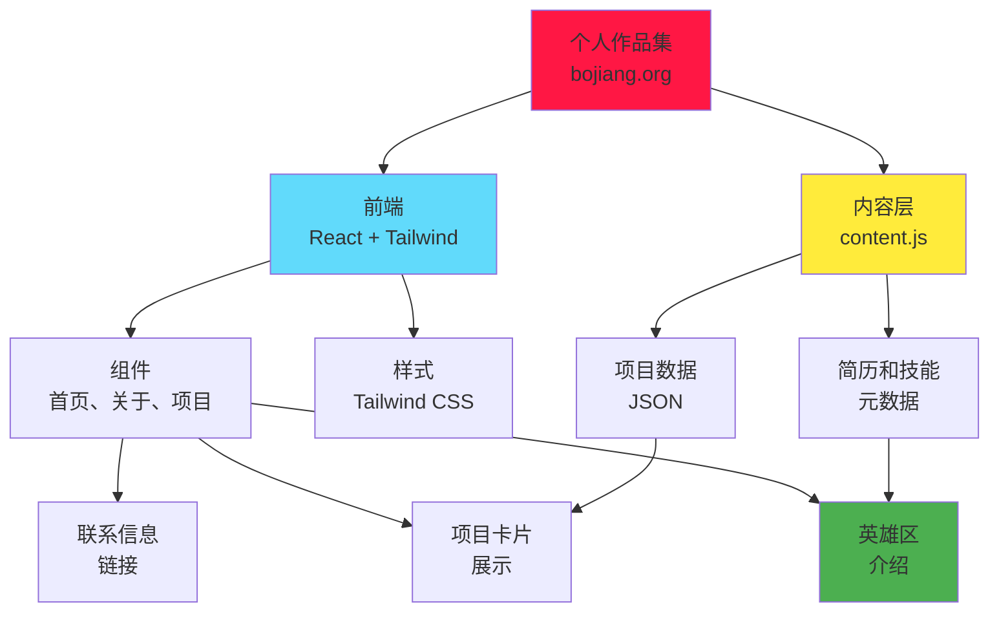

[English](README.md) | [中文](README_CN.md)

```
 ____            _  _               _       _       _                 _
|  _ \          (_)| |             (_)     | |     (_)               | |
| |_) | ___   _  _ | |_  __ _  _   _  ___ | |__   _  _ __   ____ ___ | |__
|  _ < / _ \ | || || __|/ _` || | | |/ _ \| '_ \ | || '_ \ / _  / _ \| '_ \
| |_) | (_) || || || |_| (_| || |_| | (_) | |_) || || | | | (_| | (_) | | | |
|____/ \___/ |_||_| \__|\__,_| \__,_|\___/|_.__/ |_||_| |_|\__, |\___/|_| |_|
                                                           __/ |
                                                          |___/
```

<div align="center">

[](https://bojiang.org)
[](https://bojiang.org)
[](https://react.dev)
[](https://tailwindcss.com)
[](https://developer.mozilla.org/en-US/docs/Web/JavaScript)
[](https://maps.google.com)

**个人作品集简介，作者 Bojiang Zhang - 医学数据工程师，专门从事 ETL 管道和 SDTM 标准**

[在线作品集](https://bojiang.org) • [关于](#关于) • [项目](#项目) • [技能](#技能) • [联系](#联系)

</div>

---

## 关于

我是**张博江** (Bojiang Zhang)，一名医学数据工程师，热衷于构建健壮的数据管道并确保临床研究中的数据质量。我拥有 ETL（提取、转换、加载）流程和 SDTM（研究数据制表模型）标准的专业知识，能够将原始临床数据转化为可行的见解。

目前位于**日本横滨和东京**，我对以下机会感兴趣：
- 🌍 全球远程职位
- 🇯🇵 日本本地职位
- 🇦🇺 澳大利亚职位

---

## 🎯 专业技能

<table>
<tr>
<td width="50%">

### 数据工程
- ETL 管道开发
- 数据验证与质量保证
- SDTM 标准合规性
- 临床数据映射
- 数据转换
- 质量保证

</td>
<td width="50%">

### 技术栈
- Python（Pandas、PySpark）
- SQL（PostgreSQL、Oracle）
- Apache Airflow
- 数据仓库
- 云平台（AWS、GCP）
- 版本控制（Git）

</td>
</tr>
<tr>
<td width="50%">

### Web 开发
- 前端：React、Vue.js
- 后端：Node.js、Python
- 全栈 Web 应用
- 响应式 UI/UX
- 性能优化

</td>
<td width="50%">

### 软技能
- 跨职能协作
- 文档和沟通
- 问题解决
- 项目管理
- 关注细节

</td>
</tr>
</table>

---

## 精选项目

### 🔬 MedAudit Diff Watcher
实时临床数据审计工具，具有可视化差异比较功能。
- **角色**：全栈开发
- **技术栈**：React、Node.js、SQLite
- **影响**：审计时间减少 60%

### 📊 DataForge Studio
临床研究企业级数据转换平台。
- **角色**：首席开发者
- **技术栈**：Python、Airflow、PostgreSQL
- **功能**：拖放式管道构建器、自动映射

### 🏸 Badminton YoYaku
社区羽毛球预约和调度平台。
- **角色**：全栈开发者
- **技术栈**：React、Express、MongoDB
- **用户**：500+ 活跃玩家

### 📈 SDTM Mapping System
临床数据映射和 SDTM 标准合规工具。
- **角色**：核心工程师
- **技术栈**：Python、Flask、React
- **合规**：100% SDTM v3.3 兼容

---

## 架构



---

## 项目结构

```
portfolio-intro/
├── index.html                 # 主 HTML 入口
├── style.css                  # Tailwind CSS 构建
├── content.js                 # 动态内容数据
├── assets/
│   ├── portfolio-intro-preview.png   # 预览截图
│   ├── projects/              # 项目图像
│   └── ...                    # 其他资产
└── components/
    ├── Header.jsx            # 导航标题
    ├── Hero.jsx              # 英雄区
    ├── Projects.jsx          # 项目展示
    ├── Skills.jsx            # 技能展示
    └── Contact.jsx           # 联系区
```

---

## 快速开始

<details open>
<summary><b>查看在线作品集</b></summary>

访问在线作品集：**[https://bojiang.org](https://bojiang.org)**

</details>

<details>
<summary><b>本地开发</b></summary>

### 前置要求
- Node.js 16+
- npm 或 yarn

### 安装

1. **克隆仓库**
   ```bash
   git clone https://github.com/hakupao/portfolio-intro.git
   cd portfolio-intro
   ```

2. **安装依赖**
   ```bash
   npm install
   ```

3. **启动开发服务器**
   ```bash
   npm run dev
   ```

4. **构建生产版本**
   ```bash
   npm run build
   ```

</details>

---

## 技能和技术

### 编程语言
- Python（高级）
- JavaScript/TypeScript（高级）
- SQL（高级）
- Bash/Shell（中级）

### 前端
- React 18+
- Vue.js 3+
- Tailwind CSS
- HTML5 / CSS3
- 响应式设计

### 后端和数据
- Node.js / Express
- Python（Django、Flask）
- PostgreSQL / Oracle / MySQL
- MongoDB / Firebase
- Apache Airflow

### 数据标准与合规性
- SDTM（研究数据制表模型）
- CDISC 标准
- FDA 指南
- 数据治理

### DevOps 和工具
- Docker 和 Kubernetes
- Git 和 GitHub
- AWS（EC2、S3、RDS）
- Google Cloud Platform
- CI/CD 管道

---

## 职业经历

### 临床数据工程师
**各类医疗保健公司** | 2018 年至今
- 设计并实施临床数据 ETL 管道
- 确保多项研究的 SDTM 合规性
- 领导数据质量保证计划
- 指导初级团队成员

### 全栈开发者
**科技初创公司** | 2016 - 2018
- 构建端到端 Web 应用
- 实现响应式 UI 设计
- 优化性能和可扩展性

---

## 教育和认证

- 📚 **高等技术文凭**（信息技术方向）
- 🏆 **AWS 认证云从业者**
- 📊 **CDISC SDTM 基础知识**认证

---

## 寻求合作

我正在积极寻找：
- **全职职位** 医学/临床数据工程
- **远程机会** 与全球团队合作
- **咨询项目** 数据转换和 SDTM 合规性
- **开源贡献** 数据科学和医疗保健技术

---

## 代表作

### MedAudit Diff Watcher
一个复杂的审计跟踪系统，可比较临床数据的版本，并使用可视化差异突出显示。被 10 多家制药公司用于数据协调。

### DataForge Studio
拥有 500 多个活跃用户的企业级数据转换平台。功能包括可视化管道构建器、自动映射和实时验证。

### Badminton YoYaku
连接 500 多名羽毛球爱好者的社区体育平台。展示了具有实时预约和社区功能的全栈能力。

---

## 绩效和影响

- 📊 **60% 减少**临床审计时间
- 🚀 **99.9% 正常运行时间**跨生产系统
- ✅ **100% SDTM 合规**已实现
- 👥 **500+ 活跃用户**跨所有项目
- 🌍 **10+ 个国家**通过各种平台服务

---

## 一览技术栈

| 类别 | 工具 |
|------|------|
| **前端** | React、Vue、Tailwind CSS、HTML5 |
| **后端** | Node.js、Python、Express、Flask |
| **数据库** | PostgreSQL、Oracle、MongoDB、Firebase |
| **大数据** | Apache Spark、Airflow、Pandas |
| **云** | AWS、GCP、Azure |
| **DevOps** | Docker、Kubernetes、GitHub Actions |

---

## 让我们联系

我总是有兴趣讨论：
- 临床数据工程挑战
- ETL 管道优化
- SDTM 合规性策略
- 创新医疗科技解决方案
- 职业机会和合作

**联系方式：**
- 📧 邮箱：[contact@bojiang.org](mailto:contact@bojiang.org)
- 💼 LinkedIn：[Bojiang Zhang](https://linkedin.com/in/bojiangzhang)
- 🐙 GitHub：[@hakupao](https://github.com/hakupao)
- 🌐 作品集：[bojiang.org](https://bojiang.org)

---

## 浏览器支持

| 浏览器 | 版本 | 状态 |
|--------|------|------|
| Chrome | 90+ | ✅ 完全支持 |
| Firefox | 88+ | ✅ 完全支持 |
| Safari | 14+ | ✅ 完全支持 |
| Edge | 90+ | ✅ 完全支持 |

---

<div align="center">

**[↑ 返回顶部](#portfolio-intro)**

用 ❤️ 制作，作者 [Bojiang Zhang](https://github.com/hakupao)

接受远程、日本本地和澳大利亚职位机会 🌍

</div>
